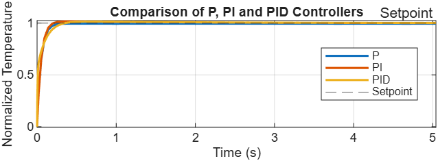
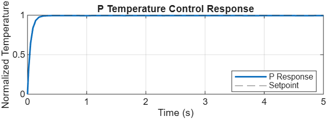
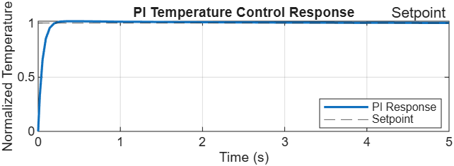
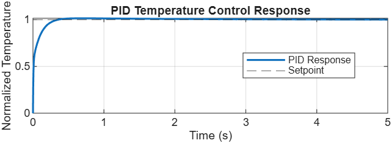
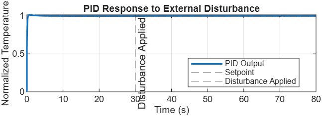

# PID Temperature Control System – MATLAB & Simulink

## Project Overview

This project presents the modeling and closed-loop temperature control of a first-order thermal system using **P, PI, and PID controllers** in MATLAB and Simulink.

The objective is to regulate the normalized temperature at a reference value of **1** and compare the performance of different controllers based on:

- Rise time
- Settling time
- Peak time
- Overshoot
- Steady-state error

The project also analyzes the ability of the PID controller to maintain the desired temperature when an external disturbance is applied at **t = 30 seconds**.

### Controller Comparison



The comparison plot shows the simulated responses of the P, PI, and PID controllers toward the desired temperature setpoint.

### Key Results

| **Controller** | **Rise Time (s)** | **Settling Time (s)** | **Peak Time (s)** | **Overshoot (%)** | **Steady-State Error (%)** |
|---|---:|---:|---:|---:|---:|
| P | 0.1144 | 0.1948 | 0.5866 | 0.0128 | 0.5179 |
| PI | 0.1092 | 0.1743 | 0.4481 | 1.6191 | 0.0693 |
| PID | 0.1496 | 0.2724 | 0.7077 | 1.5453 | **0.0026** |

The results demonstrate the effect of adding integral and derivative actions to the proportional controller. The PID configuration produces the lowest steady-state error among the tested configurations, while the PI configuration has the shortest measured rise and settling times.

---

##  Objectives

- Model a first-order thermal system using MATLAB/Simulink.
- Implement P, PI, and PID controllers.
- Compare the transient response of different controllers.
- Calculate important performance parameters.
- Analyze steady-state error.
- Test the PID controller under an external disturbance.
- Visualize the system response using MATLAB plots.

---

##  System Model

The thermal plant is modeled as a first-order transfer function:

\[
G(s)=\frac{1}{10s+1}
\]

The system uses a closed-loop feedback configuration.

### Control Structure

```text
                    ┌─────────────────────┐
                    │   P / PI / PID      │
Setpoint ──► (+) ──►│     Controller      │──► Thermal Plant ──► Output
            ▲  -    └─────────────────────┘      G(s)=1/(10s+1)
            │                                             │
            │                                             │
            └────────────────── Feedback ─────────────────┘
```

The closed-loop system continuously compares the desired temperature with the actual temperature and generates a corrective control signal.

The error signal is:

\[
e(t)=r(t)-y(t)
\]

where:

- \(r(t)\) = reference/setpoint
- \(y(t)\) = measured temperature output
- \(e(t)\) = control error

---

##  Software Used

- MATLAB
- Simulink
- Control System Toolbox

---

##  Thermal Plant Model

The thermal system is modeled as a first-order plant with the following transfer function:

```math
G(s)=\frac{1}{10s+1}
```

The general form of a first-order system is:

\[
G(s)=\frac{K}{\tau s+1}
\]

For this project:

| **Parameter** | **Value** | **Unit** |
|---|---:|---|
| Plant Gain (K) | 1 | — |
| Time Constant (τ) | 10 | s |
| Reference Temperature | 1 | Normalized |
| Plant Model | 1/(10s+1) | — |

The plant represents a simplified thermal system in which the temperature changes gradually in response to the applied control input.

---

##  PID Controller

The general PID controller is given by:

```math
C(s)=K_p+\frac{K_i}{s}+K_ds
```

The controller consists of three control actions:

### Proportional Action

The proportional term responds to the present value of the error.

\[
u_P(t)=K_p e(t)
\]

### Integral Action

The integral term responds to the accumulated error and helps reduce steady-state error.

\[
u_I(t)=K_i\int e(t)dt
\]

### Derivative Action

The derivative term responds to the rate of change of the error.

\[
u_D(t)=K_d\frac{de(t)}{dt}
\]

The complete controller output is:

\[
u(t)=K_pe(t)+K_i\int e(t)dt+K_d\frac{de(t)}{dt}
\]

---

##  Controller Parameters

The following controller configurations were used:

| **Controller** | **Kp** | **Ki** | **Kd** |
|---|---:|---:|---:|
| P | 200 | 0 | 0 |
| PI | 200 | 100 | 0 |
| PID | 200 | 100 | 10 |

The proportional gain was kept constant at **Kp = 200** while integral and derivative actions were progressively added.

The desired normalized temperature is:

**1**

---

##  Controller Comparison

The P, PI, and PID controllers were simulated using the same thermal plant and reference temperature.

The response before the external disturbance was analyzed so that the disturbance at 30 seconds would not affect the initial controller performance measurements.

### Performance Comparison

| **Controller** | **Rise Time (s)** | **Settling Time (s)** | **Peak Time (s)** | **Overshoot (%)** | **Steady-State Error (%)** |
|---|---:|---:|---:|---:|---:|
| P | 0.1144 | 0.1948 | 0.5866 | 0.0128 | 0.5179 |
| PI | 0.1092 | 0.1743 | 0.4481 | 1.6191 | 0.0693 |
| PID | 0.1496 | 0.2724 | 0.7077 | 1.5453 | **0.0026** |

### Comparison Plot


The comparison shows how the addition of integral and derivative actions changes the transient and steady-state response of the thermal system.

The **P controller** has a measurable steady-state error, while the **PI controller** significantly reduces this error. The **PID controller** produces the lowest steady-state error among the three tested configurations.

---

##  P Controller Response

The P controller was implemented using:

| **Parameter** | **Value** |
|---|---:|
| Kp | 200 |
| Ki | 0 |
| Kd | 0 |



### Results

- Rise Time: **0.1144 s**
- Settling Time: **0.1948 s**
- Peak Time: **0.5866 s**
- Overshoot: **0.0128%**
- Steady-State Error: **0.5179%**

The P controller provides a fast response with very small overshoot in the simulated system. However, it retains a measurable steady-state error.

---

##  PI Controller Response

The PI controller was implemented using:

| **Parameter** | **Value** |
|---|---:|
| Kp | 200 |
| Ki | 100 |
| Kd | 0 |



### Results

- Rise Time: **0.1092 s**
- Settling Time: **0.1743 s**
- Peak Time: **0.4481 s**
- Overshoot: **1.6191%**
- Steady-State Error: **0.0693%**

The addition of integral action significantly reduces the steady-state error compared with the P controller.

---

##  PID Controller Response

The PID controller was implemented using:

| **Parameter** | **Value** |
|---|---:|
| Kp | 200 |
| Ki | 100 |
| Kd | 10 |



### Results

- Rise Time: **0.1496 s**
- Settling Time: **0.2724 s**
- Peak Time: **0.7077 s**
- Overshoot: **1.5453%**
- Steady-State Error: **0.0026%**

The PID controller achieves the lowest steady-state error among the three tested configurations.

---

##  Disturbance Analysis

To evaluate disturbance rejection, an external disturbance was applied to the thermal system at:

**t = 30 seconds**

### Disturbance Parameters

| **Parameter** | **Value** |
|---|---:|
| Step Time | 30 s |
| Initial Value | 0 |
| Final Value | -0.2 |
| Sample Time | 0 s |

The disturbance represents an external change affecting the thermal plant while the PID controller is operating.

### PID Response to External Disturbance



The disturbance causes a deviation in the system output. Since the system uses closed-loop feedback, the deviation is detected as an error and the PID controller generates a corrective control action.

The disturbance-response simulation demonstrates the ability of the feedback-controlled system to respond to an external change and move the output back toward the desired setpoint.

---

##  Performance Parameters

### Rise Time

Rise time indicates how quickly the system response moves from the lower portion to the upper portion of its final value according to the MATLAB `stepinfo` calculation.

A lower rise time generally indicates a faster initial response.

### Settling Time

Settling time represents the time required for the response to enter and remain within the specified settling band around the final value.

### Peak Time

Peak time represents the time at which the maximum response occurs.

### Overshoot

Overshoot indicates how much the response exceeds the final steady-state value.

It is calculated as:

```math
\%OS =
\frac{y_{peak}-y_{final}}
{y_{final}}\times100
```

### Steady-State Error

For a normalized reference value of 1:

```math
e_{ss}=|1-y_{final}|
```

The percentage steady-state error is:

```math
e_{ss}(\%)=|1-y_{final}|\times100
```

---

##  MATLAB Data Analysis

The Simulink output is stored as a MATLAB `timeseries` object.

The simulation data can be extracted using:

```matlab
t = out.simout.Time;
y = out.simout.Data;
```

The controller performance can be calculated using:

```matlab
info = stepinfo(y,t);
```

For the controller comparison, only the response before the disturbance was considered:

```matlab
idx = t < 30;

t_pre = t(idx);
y_pre = y(idx);

info = stepinfo(y_pre,t_pre);
```

The steady-state error was calculated using:

```matlab
final_value = y_pre(end);

steady_state_error = abs(1 - final_value);

steady_state_error_percent = steady_state_error * 100;
```

---

##  Simulink Model

The closed-loop system consists of:

1. Normalized temperature reference
2. Error calculation using a summing block
3. P / PI / PID controller
4. First-order thermal plant
5. External disturbance input
6. Feedback loop
7. Output monitoring
8. MATLAB workspace logging using a To Workspace block

The main Simulink model is:

```text
temperature_control.slx
```

---

##  Project Structure

```text
PID-Temperature-Control-System/
│
├── temperature_control.slx
├── compare_controller.m
├── create_simulink_model.m
├── README.md
│
└── results/
    ├── P_Graph_response.png
    ├── PI_Graph_response.png
    ├── PID_Graph_response.png
    ├── Combined_P_vs_PI_vs_PID_graph.png
    ├── PID_Disturbance_Response.png
    ├── controller_metrics.csv
    └── PID_Performance_Comparison.xlsx
```

---

##  Project Files

### `temperature_control.slx`

Main MATLAB/Simulink model containing the closed-loop temperature control system.

### `compare_controller.m`

MATLAB script used to analyze and compare the P, PI, and PID controller responses.

### `create_simulink_model.m`

MATLAB script used to create/configure the Simulink model.

### `controller_metrics.csv`

Contains the numerical performance metrics obtained from the controller simulations.

### `PID_Performance_Comparison.xlsx`

Excel version of the controller performance comparison table.

### `results/`

Contains the generated controller response graphs, comparison graph, disturbance-response graph, and performance data.

---

##  How to Run

### Requirements

- MATLAB
- Simulink
- Control System Toolbox

### Steps

1. Clone the repository:

```bash
git clone https://github.com/gaurang-tak/PID-Temperature-Control-System.git
```

2. Open MATLAB.

3. Navigate to the cloned project directory.

4. Open the Simulink model:

```text
temperature_control.slx
```

5. Run the simulation.

6. Run the MATLAB analysis script:

```text
compare_controller.m
```

7. Analyze the generated response plots and performance metrics.

---

##  Key Findings

The simulation demonstrates the effect of proportional, integral, and derivative control actions on a first-order thermal system.

- **P Controller:** Provides a fast response but retains a measurable steady-state error.
- **PI Controller:** Significantly reduces steady-state error and provides a fast response.
- **PID Controller:** Produces the lowest steady-state error among the tested configurations.
- **PI Controller:** Has the shortest measured rise time and settling time in this particular simulation.
- **P Controller:** Has the lowest measured overshoot.
- **PID Controller:** Is additionally tested under an external disturbance to evaluate disturbance rejection.

The results are specific to the thermal plant model and controller gains used in this project.

---

##  Future Improvements

Possible extensions of this project include:

- PID tuning using MATLAB PID Tuner
- Automatic controller gain optimization
- Anti-windup implementation
- Derivative filtering
- Sensor noise modeling
- Nonlinear thermal plant modeling
- Real-time temperature sensing
- Arduino/ESP32 implementation
- Hardware-in-the-loop testing

---

##  Applications

The concepts demonstrated in this project are relevant to:

- Industrial temperature control
- HVAC systems
- Thermal chambers
- Electronics cooling
- Battery thermal management
- Heating systems
- Industrial process control
- Embedded temperature-control systems

---

##  Author

**Gaurang Tak**

B.Tech Electronics and Communication Engineering  
National Institute of Technology Srinagar
